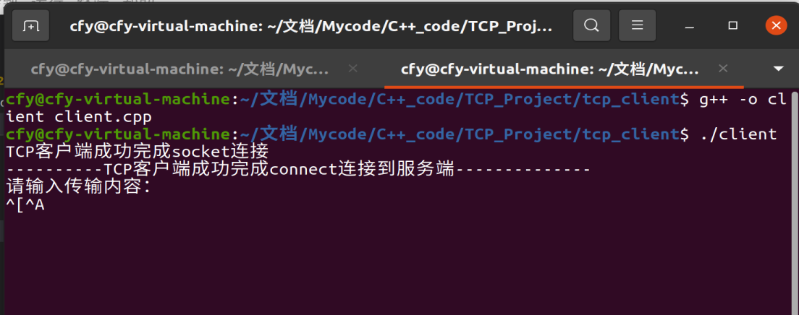
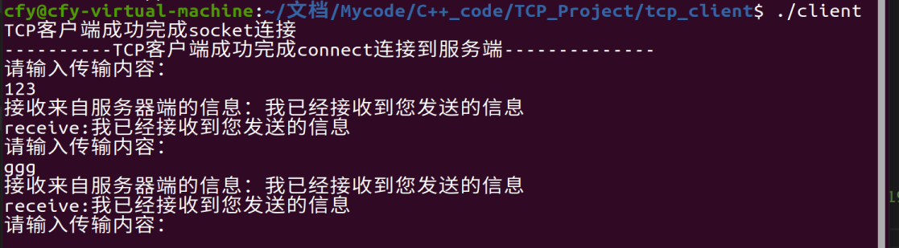
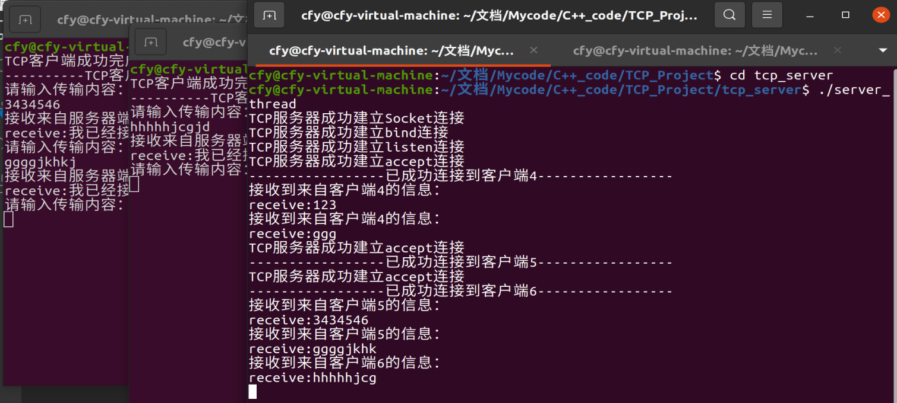

# TCP_Poject

* 该项目由C++语言进行编写的可用于网络信息传输的TCP简单项目。有两个文件<font color=Blue>**tcp_client**</font>和<font color=Blue>**tcp_server**</font>分别用于传输信息的客户端和服务端

  ## 1.TCP协议简介(便于自己复习)

  ### 1.1 TCP三次握手

  <div align=center></div>

  - 第一次握手：Client将标志位**SYN(建立新连接)置为1**，随机产生一个值seq=x，并将该数据包发送给Server，Client进入SYN_SENT状态，等待Server确认。
  - 第二次握手：Server收到数据包后由标志位SYN=1知道Client请求建立连接，Server将标志位**SYN和ACK(确认)都置为1**，**ack=x+1**，随机产生一个值seq=y，并将该数据包发送给Client以确认连接请求，Server进入SYN_RCVD状态。
  - 第三次握手：Client收到确认后，检查ack是否为x+1，ACK是否为1，如果正确则将标志位ACK置为1，ack=y+1，并将该数据包发送给Server，Server检查ack是否为y+1，ACK是否为1，如果正确则连接建立成功，Client和Server进入ESTABLISHED状态，完成三次握手，随后Client与Server之间可以开始传输数据了。

  ### 1.2 TCP四次挥手

  <div align=center></div>

  - 第一次挥手：客户端向服务器发起请求释放连接的TCP报文，置FIN为1。**客户端进入终止等待-1阶段**。

  - 第二次挥手：服务器端接收到从客户端发出的TCP报文之后，确认了客户端想要释放连接，**服务器端进入CLOSE-WAIT阶段**，并向客户端发送一段TCP报文。**客户端收到后进入种植等待-2阶段**。

  - 第三次挥手：服务器做好了释放服务器端到客户端方向上的连接准备，再次向客户端发出一段TCP报文。。此时服务器**进入最后确认阶段**。

  - 第四次挥手：客户端收到从服务器端发出的TCP报文，确认了服务器端已做好释放连接的准备，于是**进入时间等待阶段**，并向服务器端发送一段报文。**注意：第四次挥手后客户端不会立即进入closed阶段，而是等待2MSL再关闭。**

    

  ## 2. TCP客户端与服务端连接基本流程

  ](https://img-blog.csdnimg.cn/20210104185749289.png?x-oss-process=image/watermark,type_ZmFuZ3poZW5naGVpdGk,shadow_10,text_aHR0cHM6Ly9ibG9nLmNzZG4ubmV0L3FxXzMxODM3MjAz,size_16,color_FFFFFF,t_70)

  <font color=#DCDCDC>感谢CSDN博主[晓晶](https://blog.csdn.net/qq_31837203)的流程图</font>

  

  ## 3.tcp_client

  该文件夹实现了简单的客户端建立过程，依据**2**中关于客户端的建立流程建立。

  由于该项目是在<font color=blue>*Linux*</font>中进行使用,则其使用的C++库文件与Windows有些许不同

  ```c++
  #include <sys/types.h>
  #include <sys/socket.h>
  #include <netinet/in.h>
  #include <unistd.h>
  #include <arpa/inet.h>
  ```

  **我认为在进行建立时如下处最重要,是通信最关键的地方**

  ```C++
  //配置IP地址和端口
  #define Server_Addr  "192.168.233.128"
  #define PORT 8082
  
  sockaddr_in client_addr;
  //设置通信端口
  client_addr.sin_family = AF_INET;  //IPV4
  client_addr.sin_addr.s_addr = inet_addr(Server_Addr);
  client_addr.sin_port = htons(PORT);
  ```

  可以通过终端进行代码编译 <font color=green>g++ -o client client.cpp</font> 生成一个二进制文件，然后在 <font color=green>./client</font> (这里的client是  <font color=red>-o</font> 后命名的那个名字)。

  最终效果如下图所示

    

  <font color=blue>连接服务器成功后如下图所示</font>

  

​		

## 4.tcp_server

该文件夹中含有一个简单的服务端使用代码（一次只能连接一个客户端）以及一个加入线程进行开发的可以进行同时多客户端通信的服务端代码。

<font color=red size=5>（重要！！！）IP地址的选择：</font><font color=red>必须是电脑本地端口，不能任意设定。Linux通过 **ifconfig** 查询，Windows通过 **ipconfig**查询。可以使用查询到的IP或者***”127.0.0.1“***。</font>在这里我查了很久。

<font color=blue>多线程建立：</font>

```C++
//在accept处进行线程的使用，以便服务器端与多个客户端进行通信

while(true)
{
    //进行accept()连接,服务端套接字以及客户端地址和大小
    client_socket = accept(server_socket,( sockaddr*)&client_addr,(socklen_t *)&sockaddr_in_len_C);
    if(client_socket < 0)
    {
        cout<<"TCP服务器未成功建立accept连接"<<endl;
    }
    //此时与客户端连接成功，开建一个线程，通过子线程与客户端通信
    pthread_t client_thread;
    pthread_create(&client_thread,NULL,subThreadWork,&client_socket);
    pthread_detach(client_thread);  //主线程与子线程分离，两者相互不干涉，子线程结束同时子线程的资源自动回收
}  
```

<font color=blue>在 pthread_create 中含有一个函数 <font color=green>subThreadWork</font> 实现对建立的线程的处理。</font>

```C++
void *subThreadWork(void* arg)
{
    int client_socket = *(int*)arg;
    char receive[BUF_SIZE];  //数据接受缓存区
    cout<<"TCP服务器成功建立accept连接"<<endl;
    cout<<"-----------------已成功连接到客户端"<<client_socket<<"-----------------"<<endl;
    //顺利到这代表已经完成服务端和客户端的三次握手，可以进行信息传输了
    while(true)  //一直保持接收发送状态
    {
        memset(receive,0,BUF_SIZE);
        char sendTo[] = "我已经接收到您发送的信息"; //需要发送给客户端的信息
        int recv_flag = recv(client_socket,receive,BUF_SIZE,0);//recv_flag返回实际读取到的字节数
        if(recv_flag >0)
        {
            cout<<"接收到来自客户端"<<client_socket<<"的信息："<<endl;
            
            
            cout<<"receive:"<<receive<<endl;
            if( (string)receive == "close")
            {
                const char* close = "close";
                send(client_socket,close,sizeof(close),0);
                sleep(0.1);
                break;     //结束while循环
            }
            //const char * sendData = "你好，TCP客户端！\n";
            int send_flag = send(client_socket,sendTo,sizeof(sendTo),0);//发送成功则返回发送的字节数大小给send_flag
            if(send_flag != sizeof(sendTo))
            {
                cout<<"未成功发送信息至客户端"<<endl;
            }

        }
    }
        
    //关闭服务端监听
    close(client_socket);
    cout<<"已关闭客户端"<<client_socket<<"连接"<<endl;
    pthread_exit(NULL); //直接结束线程，无需影响主线程及其他线程
}
```

* 服务端建立过程与客户端基本类似，编译时<font color=red>需要注意: g++ server_thread.cpp -o server_thread -phread(或者-lphread)</font>

实现效果如下：




## 5.结语及注意

很高兴第一次编写Readme文件，对于知识进行了再次梳理，对项目的理解度更上一层。

<font color=green size=5>通过手机对电脑服务端通信有时成功，有时失败，目前仍未发现原因（至少手机跟电脑必须在同一个IP地址，使用手机热点）</font>

<font color=red size=7>注意客户端的IP和端口必须一致</font>


